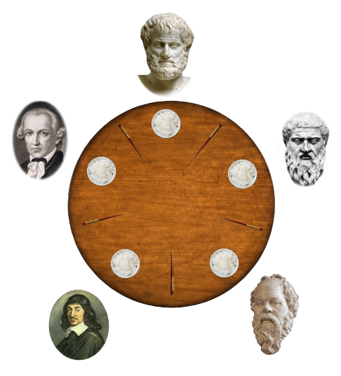

# Philosophers – 42 Project

## 📍 Objective
Implement the Dining Philosophers problem in C, using threads and mutexes, while respecting timing constraints and avoiding deadlocks and race conditions.

The program must follow the rules:
- Multiple philosophers sit around a table.
- Each philosopher alternates between eating, sleeping, and thinking.
- To eat, a philosopher needs two forks.
- The simulation stops if a philosopher dies or if all philosophers have eaten enough times.

## 🧵 Concepts Practiced
- Threads (`pthread`)
- Mutexes
- Race conditions
- Deadlocks
- Time management in concurrent environments

---

## 🛠️ Build and Run
- For the mandatory part (Threads) :
```bash
make
#./philo number_of_philosophers time_to_die time_to_eat time_to_sleep [number_of_meals]
./philo 5 800 200 200
```
- For the bonus part (Semaphores):
```bash
make bonus
#./philo_bonus number_of_philosophers time_to_die time_to_eat time_to_sleep [number_of_meals]
./philo_bonus 5 800 200 200
```
